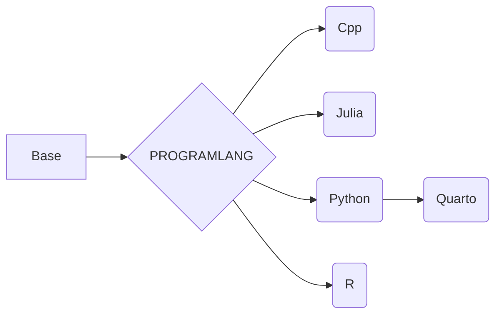

# Denv
English | [中文](README_CN.md)

**THIS doc for non-CN USER**

**dockerhub: https://hub.docker.com/r/ben0i0d/denv**
## About
This is a project extracted from the Jupyter project to create a development container. Its build produces a container for a unified development environment, retaining only the essential toolchain required for development.

In the future, we are considering creating an Renv project based on this one to provide a lighter-weight runtime environment.

## Upstream
https://github.com/ben0i0d/jupyter-image-stacks

## HOW TO USE

### Use like a container
you can just `docker run -it`

### Use like a devcontainer(VScode)
`cp -r .devcontainer WORKSDIR`

## NOTICE
1. python version hook on 3.11 (we remove mamba，because we think it is not necessary)
2. quarto only contain Quarto,Python,just used to render ipynb

## Image dependencies
