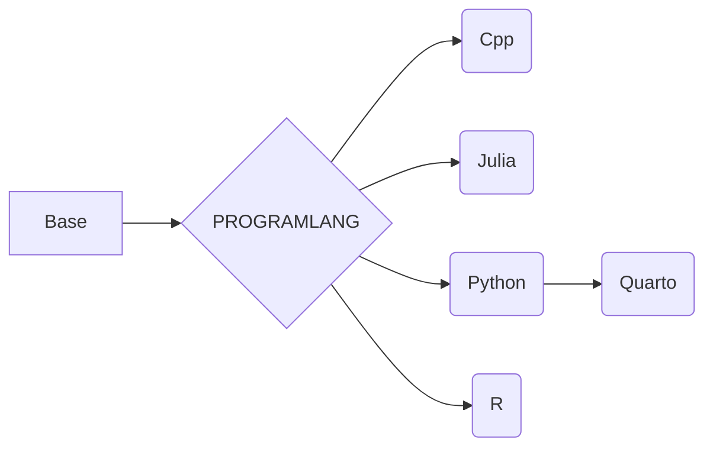

# Denv
English | [中文](README_CN.md)

**为中国用户的文档**

**我们的docker镜像仓库是 https://hub.docker.com/r/ben0i0d/denv**
## 项目梗概
这是一个从Jupyter 项目中分离出来用于创建开发容器的项目，其构建产物是用于统一开发环境的容器。它仅保留了开发所需的基本工具链。

未来，我们考虑基于该项目创建一个 Renv 项目，以提供一个更轻量级的运行时环境。

## 项目上游
https://github.com/ben0i0d/jupyter-image-stacks

## 如何使用

### 普通容器
运行`podman run -it`

### devcontainer(VScode)
执行`cp -r .devcontainer WORKDIR`

## 注意
1. python 版本锁定 3.11 (我们移除了 mamba，因为我们认为它不必要)
2. quarto 只包括 Quarto,Python，用来渲染ipynb
## 镜像依赖关系
